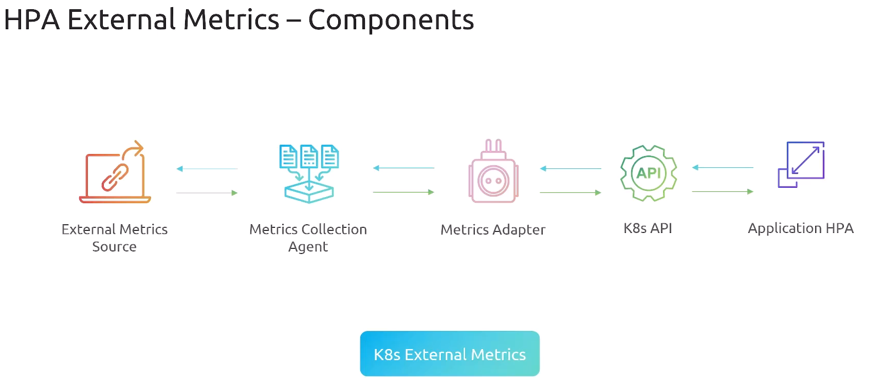

# AutoScaling
> ### Features:
- Improve Application Availability
- Efficient Resource Utilization
- Elasticity
- Fault tolerance & Recovery
- Seamless Load Manager
- Simplify Management

> ### Kubernetes Scaling
- Cluster Scaling: Worker node Scaling
    - Ensure the Infra is up to the workload needed
- Pod Scaling
    - Ensure the App is up to the workload needed

> ### Manual Scaling 
- Manual `HPA`:
    - Increase Replicas of a deployment 
    - Each pod will have it's hostname
    - App should be stateless
```bash
kubectl scale deployment my-deploy --replicas=5
```
- Manual `VPA`:
    - Make a pod has more resources
    - Modify the `spec.resources` of deployment

## HPA
- `Horizontal Pod Autoscaling`:  Increase the units that handel the workload **`+Pods`**
- `HPA` works with *Deployment* & *Statefulset*
- We need to define resources in or Deploy/stateful, also we need metrics server
- How it works:
    - HPA need Metrics Server to be configured
    - We Define a resource of HPA with target Deploy and Metric Threshold 
    - HPA tracks key Metrics & Evaluate
    - Adjust workload by adding or removing replicas of pods based on the Metrics
    - Run in Control loop to make sure every thing is okay as desired
- `HPA Arch`:
    - Resource Definition: Define target Deployment, Min/Max Replicas, Metrics Threshold
        - Based on this the kube-api collect metrics and take actions
    - Metric Server: Server that collect metrics 
    - Metrics Collection Source: 
        - ***Custom collection***: workload in the cluster 
        - ***External collection***: External data Source
    - Metrics Adaptor: sit between kube-api and collection sources --> `Custom Adaptor`, `External Adaptor`
    - Metrics API: 
        - *metrics.k8s.io*: 
        - *custom.metrics.k8s.io*: App Gen, originate within cluster
        - *external.metrics.k8s.io*: External Gen, originate outside cluster

- `HPA Custom Metrics`: 
    - `Custom` means that we will not use native Metrics Server
    - In order to collect custom metrics we use custom 
    - The `Application` will expose the custom metrics that we need to get
    - `Metrics Collection Agent`: Get Metrics from the app then it sends to `Metrics Adaptor`
    - `Metrics Adaptor`: will provide the metrics to the `kube-api`
    - `Kube-api` will check the `HPA Rules` and apply what is needed 
- `HPA Scaling Policy`:
    - Rules and Guidlines that tell how to scale up and down and when
    - stabilization window
        - Scale up aggressively
        - Scale down conservatively
<div style="text-align: center;">

</div>

```yaml
apiVersion: autoscaling/v2
kind: HorizontalPodAutoscaler
metadata:
  name: my-app-hpa
  namespace: default
spec:
  scaleTargetRef:
    apiVersion: apps/v1
    kind: Deployment
    name: my-app
  minReplicas: 2
  maxReplicas: 10
  metrics:
    - type: Resource
      resource:
        name: cpu
        target:
          type: Utilization
          averageUtilization: 70
    - type: Pods
      pods:
        metric:
          name: requests_per_second
        target:
          type: AverageValue
          averageValue: 100
  behavior:
    scaleUp:
      stabilizationWindowSeconds: 30
      policies:
        - type: Pods
          value: 3
          periodSeconds: 60
        - type: Percent
          value: 100
          periodSeconds: 60
      selectPolicy: Max
    scaleDown:
      stabilizationWindowSeconds: 60
      policies:
        - type: Pods
          value: 2
          periodSeconds: 60
        - type: Percent
          value: 50
          periodSeconds: 60
      selectPolicy: Min
```
## VPA

## Cluster Scaling

## KEDA


## Notes:
```bash
helm repo add prometheus-community https://prometheus-community.github.io/helm-charts
helm repo update
helm install prometheus prometheus-community/prometheus --namespace prometheus --create-namespace --version 26.1.0  
kubectl edit configmap prometheus-server -n prometheus
apiVersion: v1
data:
  alerting_rules.yml: |
    {}
  alerts: |
    {}
  allow-snippet-annotations: "false"
  prometheus.yml: |
    global:
      evaluation_interval: 1m
      scrape_interval: 1m
      scrape_timeout: 10s
    rule_files:
    - /etc/config/recording_rules.yml
    - /etc/config/alerting_rules.yml
    - /etc/config/rules
    - /etc/config/alerts
    scrape_configs:
    - job_name: 'custom-metrics'                  #added
      static_configs:                             #added
      - targets: ['flask-prometheus-app-service.default.svc.cluster.local'] #added
    - job_name: prometheus
      static_configs:
      - targets:
        - localhost:9090
    - bearer_token_file: /var/run/secrets/kubernetes.io/serviceaccount/token
      job_name: kubernetes-apiservers
      kubernetes_sd_configs:
helm install prometheus-adapter prometheus-community/prometheus-adapter -n prometheus

We have installed Prometheus Operator and Prometheus Adapter.
We configured Prometheus to scrape metrics from applications.
We configured Prometheus Adapter to export the metrics as custom metrics to Kubernetes.
After introducing load, we were able to query the metrics and observe the values changing.


Verify if Prometheus Adapter is returning the correct value. Use the following command:
kubectl get --raw "/apis/custom.metrics.k8s.io/v1beta1/namespaces/default/pods/*/rabbitmq_queue_messages"| jq
```