# CKA Certification Course - Certified Kubernetes Administrator


# Exam
## Focus Topics
- change Context
- --sort-by
- dry run for file construction
- what pod on what node 

## Strange Topics


## Curriculum
<details>
  <summary><strong>Cluster Architecture, Installation & Configuration 25%</strong></summary>
  <ul>
    <li>Cluster Architecture</li>
    <li>Cluster Maintenance</li>
    <li>installing a Kubernetes cluster (Kubeadm)</li>
    <li>Kustomize</li>
    <li>Helm</li>
    </ul>
</details>

<details>
  <summary><strong>Services & Networking 20%</strong></summary>
  <ul>
    <li>Cluster Maintenance  </li>
    <li>installing a Kubernetes cluster (Kubeadm)</li>
    <li>Kustomize</li>
    <li>Helm</li>
    </ul>
</details>

<details>
  <summary><strong>Workloads & Scheduling 15%</strong></summary>
  <ul>
    <li>Scheduling  </li>
    <li>Application Lifecycle</li>
    </ul>
</details>

<details>
  <summary><strong>Troubleshooting 30%</strong></summary>
  <ul>
    <li>Cluster Maintenance  </li>
    <li>installing a Kubernetes cluster (Kubeadm)</li>
    <li>Kustomize</li>
    <li>Helm</li>
    </ul>
</details>

<details>
  <summary><strong>Storage 10%</strong></summary>
  <ul>
    <li>Cluster Maintenance  </li>
    <li>installing a Kubernetes cluster (Kubeadm)</li>
    <li>Kustomize</li>
    <li>Helm</li>
    </ul>
</details>


# Core Concepts

## Cluster Architecture
<div style="text-align: center;">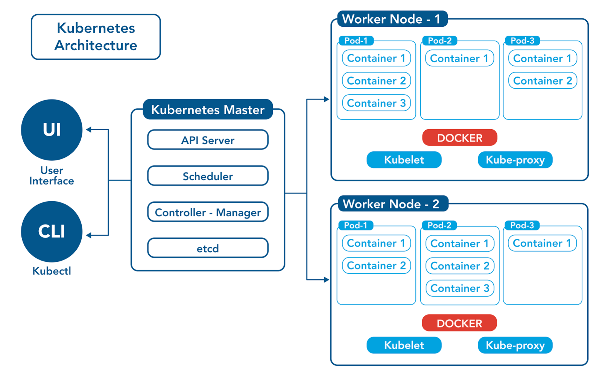</div>

- > Master Node Components
- `ETCD`
    - Very high speed Distributed Key-value Store
    - Port 2379
    - Use *etcdctl* command line

- `Kube Api Server`
    - Central point of communication for k8s components
    - Pod_creation: auth -> validate -> retrieve data -> update ETCD -> schedule -> kubelet 
    - Use SSl Certs for authentication

- `Kube Controller Manager`
    - The mind that monitor and take actions based on the current status
    - Node Controller: Monitor nodes
    - Replication Controller: Monitor replicas
    - many other controllers

- `Kube Scheduler`
    - Only decide which pod go to which node

- `kubelet`
    - Manage running Pods on nodes 

- `Kube-proxy`
    - Look for new services 
    - Then create rules on each node to route traffic using iptables rules


# Scheduling

## Manual Scheduling
- Each pod got assigned to a node while creation 
- This add field called `nodeName` in pod **Spec**
- What schedule do?
  - It goes for all pods that has no nodeName set and then decide which node to assign this pod to by an algorithm
  - Then the scheduler do *Bind Pod to Node* by creating a binding object
- You can't modify the node of the pod assigned by directly using `nodeName` 
- You can do it by creating pod Binding to the target node
- And send post api request with json formate of binding to `http://$SERVER/api/v1/namespaces/default/pods/$PODNAME/binding/

```yaml
apiVersion: v1
kind: Binding 
metadata:
  name: binding_name
target:
  apiVersion: v1
  kind: Node
  name: node_name
```

## Labels & Selectors & Annotations
- Standard matter to group things together 
- Used to match the target pods controlled by ReplicaSet or Deployment or Service
### Labels
- Properties attache to each item
```yaml
apiVersion: v1
kind: Service
metadata:
  name: my-service 
  Labels:
    app: app1
    function: Backend
    tier: db
```

### Selectors 
- Help you to filter these items
- By Impeditive way, CLI for debugging:
```bash
kubectl get pod --selector app=app1
kubectl get all --selector env=prod,bu=finance,tier=frontend
kubectl get pod -l app=app1
```
- By Declarative way, Manifests:
```yaml
apiVersion: apps/v1
kind: Deployment
metadata:
  name: app-deployment
spec:
  replicas: 5
#--------------------- this section
  selector:         #-
    matchLabels:    #-   
      tier: app     #-
#---------------------
  template:
    metadata:
#--------------------- Match this section
      labels:       #-
        tier: app   #-
#--------------------- 
    spec:
      containers:
        - name: nodejs
```

### Annotations 
- Annotations = extra info, not used for filtering
- Useful for tools, configs, custom logic

```yaml
annotations:
  prometheus.io/scrape: "true"
  prometheus.io/port: "9090"
```


## Taints & Toleration
- In order to control which pod can be scheduled on which node we use Taints & Toleration
- Set restriction on **Nodes (Taints)** & **Pods (Toleration)** 
- > Taints: key=value:taint-effect
- Tainting a Node with high resources for critical workload
  - **Taint-effect**: *the action that a taint has on a node regarding to scheduling pods*
    - *NoSchedule*: the pod will not be scheduled on this node
    - *PreferNoSchedule*: System will try to avoid to schedule the pod on this node
    - *NoExecute*: affects pods that are already running on the node, Pods that do not tolerate the taint are evicted

Taints and toleration will not grantee that a pod will be placed in specific node, it will only prevent scheduling pods on a node with specific taint

```bash
kubectl taint nodes node_name key=value:taint-effect      # add taint
kubectl taint nodes node01 app=blue:NoExecute             # add taint
kubectl taint nodes node01 app=blue:NoExecute-            # remove taint
```
- `Tolerating` a Pod:
  - Giving a Pod the ability to be accepted and scheduled on a Node that has a matching taint.
  - Edit the pod definition file
```yaml
apiVersion: v1
kind: Pod
metadata:
  name: my-pod
spec:
  containers:
  - name: nginx
    image: nginx
  tolerations:
  - key: "app"
    operator: "Equal"
    value: "blue"
    effect: "NoSchedule"
      
```

## Node Selector
- We can label nodes with key/value pair to schedule specific pod "high computing consumption" to Node with "High resources"
- First label a node:
```bash
kubectl label nodes node_name key=value
```
- Edit pod file:
```yaml
apiVersion: v1
kind: Pod
metadata:
  name: my-pod
spec:
  containers:
  - name: nginx
    image: nginx
  nodeSelector:
    size: Large
```
- **Node Selector has limitation that will be overcome in Node Affinity**

## Node Affinity
- Scheduling pod based on conditions of existing labels assigned to nodes
- Using terms to match which node to be schedule on 
- Types:
  - `requiredDuringSchedulingIgnoredDuringExecution`
  - `preferredDuringSchedulingIgnoredDuringExecution`
- Ex: schedule the pod on a node that has label size and the value is not Small
```yaml
spec:
  containers:
    - name: data-processor
      image: data-processor
  affinity:
    nodeAffinity:
      requiredDuringSchedulingIgnoredDuringExecution:
        nodeSelectorTerms:
          - matchExpressions:
              - key: size
                operator: NotIn
                values:
                  - Small
```

## Node Affinity + Taints & Toleration
- In order to have a higher control on where our pods will go and what our nodes will accept we use:
  - > ### Taints & Toleration
    - This control which pods our nodes accepts
  - > ### Node Affinity
    - This control which nodes our pods has to be schedule on.

## Resource Limit
- Requests: This is the minimum amount of CPU or memory that a container needs.
- Limits: This is the maximum amount of CPU or memory a container can use.
- If pod needs more:
  - For memory: It is killed (OOMKilled).
  - For CPU: It is throttled (slowed down), not killed.
```yaml
resources:
  requests:
    memory: "256Mi"
    cpu: "250m"
  limits:
    memory: "512Mi"
    cpu: "500m"
```
- Best options to use may be one of this:
  - Define Requests & Limits 
  - Define Requests & No Limits

- **`LimitRange`**: sets default and maximum resource limits/requests for containers or pods in a namespace.
  - `default`: default limits if not specify
  - `defaultRequest`: default Rrequests if not specify
  - `min`: lower bound *cannot request or limit less than this*
  - `max`: upper bound *cannot request or limit more than this*
```yaml
apiVersion: v1
kind: LimitRange
metadata:
  name: resource-limits
  namespace: my-namespace
spec:
  limits:
    - default:
        cpu: 500m
        memory: 512Mi
      defaultRequest:
        cpu: 200m
        memory: 256Mi
      max:
        cpu: 1
        memory: 1Gi
      min:
        cpu: 100m
        memory: 128Mi
      type: Container
```

- **`ResourceQuota`**: Limits the total amount of resources *CPU*, *memory*, *pods*, *PVCs* that can be used in a namespace.  
```yaml
apiVersion: v1
kind: ResourceQuota
metadata:
  name: dev-quota
  namespace: dev
spec:
  hard:
    requests.cpu: "2"
    requests.memory: "4Gi"
    limits.cpu: "4"
    limits.memory: "8Gi"
    pods: "10"
    persistentvolumeclaims: "5"
```

## DaemonSet
- Same as deployment or replicaSet but it will deploy a pod in each node in the cluster
- Main purpose: Make sure a pod running on each node.
- It use default Scheduler + Node Affinity rules to do so.
- Ex: CNI Agent pod, Monitoring, Kube-proxy

## StaticPods
- kubelet can create pods using two ways thought **apis**, **staticPods**
- If we have a node that is not part of cluster
- We want to run pods in this node *we don't have kube-api/kubectl* 
- we put pods manifests in a path that defined to kubelet to manage it by itself
- Path is defined in kubelet service *--pod-manifest-path=/etc/Kubernetes/manifests*, *config=kubeconfig.yaml* "staticPodPath: /etc/Kubernetes/manifests" 
- when kubelet join a cluster we can see static pods but no managing through api-server
- Same way the Kubeadm works *putting manifests of the master control components in the path of kubelet*
  - `Deploy Control Plane Components as Static Pods` **^~\_Kubeadm_/~^**
- It ignored by kube-scheduler

- > ### Practice Notes
- StaticPods will have the name of its node at the end
- When editing this images we have to edit the manifests file 
- To delete or manage staticPods:
  - cat /var/lib/kubelet/config.yaml -> 'To find **staticPodPath:**'
  - Go this path and edit the manifests

## Priority Classes
- Help to define priority for our Higher priority workload use **Priority Classes**
- Global resource "No NS bound"
- Define PriorityClass
```yaml
apiVersion: scheduling.k8s.io/v1
kind: PriorityClass
metadata:
  name: high-priority
value: 1000000000
globalDefault: false
description: "This priority class is for high-priority system pods."
preemptionPolicy: Never
```
- Then when defining a pod add *`priorityClassName: high-priority`*
- `preemptionPolicy`: The process where the Kubernetes scheduler evicts lower-priority pods to make room for higher-priority pods when resources are scarce.

## Multiple Schedulers
- We can use more than one scheduler in or K8s Cluster 
  - Scheduler creation consist of `ConfigMap`, `ServiceAccount`, `ClusterRole`, `ClusterRoleBinding`, `KubeSchedulerConfiguration`
  - We should specify in our pod/deployment definition 

```yaml
apiVersion: v1 
kind: Pod 
metadata:
  name: nginx 
spec:
  containers:
  - image: nginx
    name: nginx
  schedulerName: my-scheduler
```

## Configuring Kubernetes Scheduler Profiles
<div style="text-align: center;">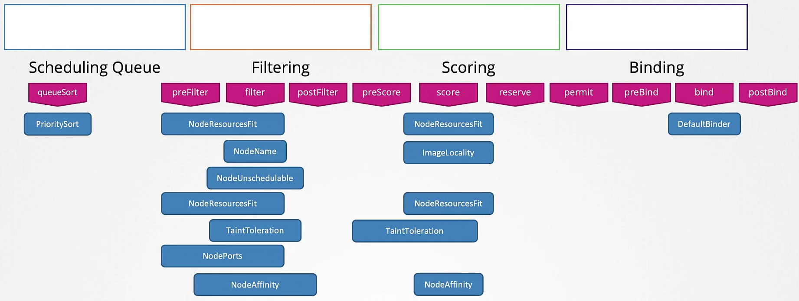</div>

- Stages *Plugins* that a Pod get thorough to be scheduled:
  - **`Scheduling Queue`**: This is the QueueSort phase. Pod is added to the scheduling queue. Based on the priority given to the pod it starts to schedule the pod PriorityClasses.
    - PrioritySort 
  - **`Filtering`**: This is the Filter phase. In this phase nodes that cannot schedule the pod are filtered based on resource limits, taints & tolerations, etc.
    - NodeResourceFit
    - NodeName
    - NodeUnschedule  
    - TaintToleration
  - **`Scoring`**: This is the Score phase. In this phase, the scheduler scores the nodes filtered based on the free space available before and after scheduling and then assigns a score. The node with the highest score is taken.
    - ImageLocality
    - TaintToleration
    - NodeAffinity
  - **`Binding`**: This is the Bind phase. In this phase, the pod is bound to the node with the highest score and now the pod is finally scheduled.
    - DefaultBinder

- Another Problem raised when having multiple Scheduler `RaceCondition`
- Solution: instead of having multiple scheduler binaries we could have multiple scheduler profile

## Admission Controllers 
<div style="text-align: center;">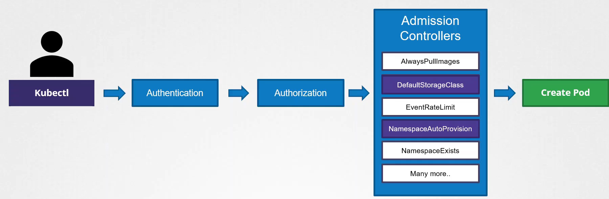</div>

- When a user perform action in k8s like creating a pod, the request go through 
  1. Authentication (*Certificates*)
  2. Authorization (*RBAC*)
  3. Admission Controllers (Plugins)
  4. Do the Action.

- In the admission controller we can enable and disable plugins like namespace, storage related plugins.
- Edit the `kube-apiserver.yaml`:
```yaml
--enable-admission-plugins=NodeRestriction,NamespaceAutoProvision
--disable-admission-plugins=DefaultStorageClass
```

### Validating and Mutating Admission Controllers
- There are two main functions of the admission controller 
  - Mutating a resource creation request, *Ex: adding default StorageClass to PVC if don't have*
  - Validating a resource creation request, *Ex: make sure NS exist*

- To define Custom plugins we Use ***MutatingAdmission Webhook*** & ***ValidatingAdmission Webhook***
- To achieve this:
  - Deploy our Admission Webhook Server (In or Out of the cluster)
    - In case of Deploy in cluster, we need to use TLS cert `Secrets` to Authentication
  - Define MutatingAdmission Webhook, ValidatingAdmission Webhook

```yaml
apiVersion: v1
kind: Secret
metadata:
  name: webhook-certs
  namespace: default
type: Opaque
data:
  tls.crt: <base64 of tls.crt>
  tls.key: <base64 of tls.key>
---
apiVersion: admissionregistration.k8s.io/v1
kind: ValidatingWebhookConfiguration
metadata:
  name: deny-latest-image
webhooks:
  - name: deny.latest.image.k8s.io
    rules:
      - apiGroups: [""]
        apiVersions: ["v1"]
        operations: ["CREATE"]
        resources: ["pods"]
    clientConfig:
      service:
        name: validating-webhook
        namespace: default
        path: "/validate"
        port: 443
      caBundle: <base64-tls.crt>
    admissionReviewVersions: ["v1"]
    sideEffects: None

```

# Application Lifecycle

## Rollout - Rollback & Versioning
- When we create Deployments it create a `Revision`, and when we update the deploy, new `Revision` is created. (To keep track of the versions of our deployment) 
- We can rollback (***rollout undo***) to a previous version of our deployment

```bash
kubectl rollout status deploy/deployname
kubectl rollout history deploy/deployname
kubectl rollout undo deploy/deployname
```

## Deployment Strategies
 1. RollingUpdate (Default)
Default strategy in any Deployment.

Gradually replaces pods: one by one (or a few at a time).

Zero downtime if app is built for it.

2. Recreate
Deletes all old pods first, then starts new ones.

Downtime occurs (service may be unavailable temporarily).


## Configuring applications
### Configuring Commands and Arguments on applications
- When we develop container that will accept command or arguments 
- We need to pass this to the container by `args` & `command`
- > In Docker we have 
  - ENTRYPOINT: default and unchangeable command 
  - CMD:  defines default arguments to that command
- > In K8s:
- **command**: Used to pass commands to containers *Ex: ENTRYPOINT*
- **args** : Used to pass argument to the containers *Ex: CMD*

```yaml
kind: Pod
spec:
  containers:
  - name: mycontainer
    image: someimage
    command: 
      - "sh"
      - "-c"       # This is like ENTRYPOINT
    args: 
      - "echo Hello from K8s"  # This is like CMD
```

### Configuring Environment Variables
- In Pod/container definition we can configure env variables in 3 ways:
  - Plain key/value
  - ConfigMap
  - Secrets
- Variables Injection:
  - Single var: `env:`
  - multi var: `envFrom:`

```yaml
# Plain key/value
env:
  - name: APP_T
    value: prod
# Single Env Var
env:
  - name: APP_T
    valueFrom:
      configMapKeyRef:
        name: configmapname
        key: APP_T
# All Env Var
envFrom:
  - configMapRef:
    name: configmapname
# Single Env Secret Var
env:
  - name: APP_T
    valueFrom:
      secretKeyRef:
        name: secretname
        key: APP_T
# All Env Secret Vars       
envFrom:
  - secretRef:
    name: secretname
```

### Configuring ConfigMaps 
- We go through 2 phases:
  - Create ConfigMap
  - Inject it to 

```bash
kubectl create configmap configmap-name --from-literal=APP_T=prod
kubectl create configmap configmap-name --from-file=filepath.properties
```
```yaml
apiVersion: v1
kind: ConfigMap
metadata:
  name: app-config
data:
  APP_MODE: "production"
  APP_PORT: "8080"
  LOG_LEVEL: "info"
```

### Configuring Secrets
- We go through 2 phases:
  - Create Secret
  - Inject it to 

```bash
kubectl create secret type secret-name --from-literal=APP_T=prod
kubectl create secret type secret-name --from-file=filepath.properties
echo -n 'secretpass' | base64
echo -n '64encoded' | base64 --decode 

```
```yaml
apiVersion: v1
kind: Secret
metadata:
  name: app-secret
data:
  APP_MODE: "64encoded"
  APP_PORT: "64encoded"
  LOG_LEVEL: "64encoded"
```

### Configure Secret Data At Rest 
- Enabling Encryption at Rest for Secrets so they are stored encrypted in **ETCD.**
- By default, secrets stored in etcd and etcd is not encrypted.
- Kubernetes ways to keep secrets security:
  - A secret is only sent to a node if a pod on that node requires it.
  - Kubelet stores the secret into a tmpfs so that the secret is not written to disk storage.
  - Once the Pod that depends on the secret is deleted, kubelet will delete its local copy of the secret data as well.

- Test Retrieve secrets from etcd
```bash
sudo apt install etcd-client
ETCDCTL_API=3 etcdctl \
   --cacert=/etc/kubernetes/pki/etcd/ca.crt   \
   --cert=/etc/kubernetes/pki/etcd/server.crt \
   --key=/etc/kubernetes/pki/etcd/server.key  \
   get /registry/secrets/default/nameofsecret
```

- To Encrypt Secretes at Rest:
- Update kube-apiserver to have `--encryption-provider-config=/etc/kubernetes/enc/enc.yaml` in command
- Create EncryptionConfiguration with first provider to not `identity==noencrypt`


```yaml
apiVersion: apiserver.config.k8s.io/v1
kind: EncryptionConfiguration
resources:
  - resources:
      - secrets
    providers:
      - aescbc:
          keys:
            - name: key1
              secret: whknLZRnFbbWsMu3KSYtxx4ROfttGKuWwhkzAZYFKE0=
      - identity: {}
```

- Then encrypt the secrets before enabling encryption by 
  - command: `kubectl get secrets --all-namespaces -o json | kubectl replace -f -`


## Multi Container Pods
- In Microservice Application pattern we use Multi container pods
- Serve as side car or as helper container for the main containers
- Both containers share localhost IP and space
- Design patterns:
  - Co-located Containers
  - Regular init Containers
  - Sidecar Containers

```yaml
apiVersion: v1
kind: Pod
metadata: 
  name: macpod
spec:
  containers:
  - name: container1
    image: image1
  - name: container2
    image: image2
```
### Init Container
- An init container is a special container that runs before the main containers in a Pod. Each init container must succeed (exit 0) before the next one is started. Once all init containers complete, the regular containers start simultaneously.
- They are configured similarly to other containers but are placed in the initContainers section of the Pod spec.
- If Init Container has ***restartPolicy: Always*** this consider Native Sidecars

```yaml
apiVersion: v1
kind: Pod
metadata:
  name: myapp-pod
  labels:
    app: myapp
spec:
  initContainers:
    - name: init-myservice
      image: busybox:1.31
      command: ["sh", "-c", "until nslookup myservice; do echo waiting for myservice; sleep 2; done;"]
  containers:
    - name: myapp-container
      image: busybox:1.28
      command: ["sh", "-c", "echo The app is running! && sleep 3600"]
```

### Native Sidecar Containers

- > How Native Sidecars Work
- Declared using the restartPolicy: Always field inside the initContainers block.
- Kubernetes treats such containers as sidecars, ensuring they:
  - Start before main containers.
  - Run alongside them.
  - Shut down after the main containers complete.
```yaml
apiVersion: v1
kind: Pod
metadata:
  name: sidecar-example
spec:
  initContainers:
    - name: sidecar-logger
      image: busybox:1.31
      restartPolicy: Always
      command: ["sh", "-c", "while true; do echo Sidecar running; sleep 10; done"]
  containers:
    - name: main-app
      image: busybox:1.31
      command: ["sh", "-c", "echo Main app starting; sleep 60"]
```


## AutoScaling
- > Two main scaling 
  - Cluster Scaling (add more nodes || Increase nodes resources) 
  - Workload Scaling (add more bods || Increase pods resources)

### HPA Horizontal Pod Autoscaler: 
- Built in k8s
- Types:
  - manual scaling 
  - Automatic scale 
```bash
kubectl scale deploy flask-web-app --replicas=3
kubectl autoscale deploy my-deploy --cpu-percent=50 --min=1 max=10
```

### Vertical Pod Autoscaling (VPA)
- Increase resource in place or by restart
- > ***`Components of Vertical Pod Autoscaler (VPA)`***
The Vertical Pod Autoscaler (VPA) project consists of 3 key components that work together to monitor, recommend, and adjust resource requests for Kubernetes pods. These components include the following:

1. Recommender
- Role: The Recommender continuously monitors the current and past resource consumption (CPU and memory) of containers.
- Functionality:
  - Based on the observed usage, it provides recommended values for the containers' CPU and memory requests.
  - These recommendations are used by the other components to adjust the resource allocations for containers.
- Purpose: Ensures that the resource requests of containers are always optimally set based on their actual usage, helping avoid both over-provisioning and under-provisioning of resources.
2. Updater
- Role: The Updater is responsible for ensuring that running pods have the correct resource requests as per the Recommender's suggestions.
- Functionality:
  - It checks which of the managed pods have outdated or incorrect resource settings.
  - If a pod's resources need to be updated, the Updater will evict (terminate) the pod so that it can be recreated by its controller (e.g., Deployment, ReplicaSet) with the updated resource requests.
- Purpose: This ensures that the running pods always have the recommended resources by restarting pods with the updated requests if necessary.
3. Admission Plugin
- Role: The Admission Plugin sets the correct resource requests on new pods, either when they are first created or when they are recreated due to the Updater's action.
- Functionality:
  - It works during the pod creation process, checking if the pod is managed by VPA.
  - If the pod is managed by VPA, it modifies the pod's resource requests to reflect the recommended values provided by the Recommender.
- Purpose: Ensures that newly created or recreated pods start with the optimal resource requests from the very beginning.

```yaml
apiVersion: "autoscaling.k8s.io/v1"
kind: VerticalPodAutoscaler
metadata:
  name: flask-app
spec:
  targetRef:
    apiVersion: "apps/v1"
    kind: Deployment
    name: flask-app-4
  updatePolicy:
    updateMode: "Off"  # You can set this to "Auto" if you want automatic updates
  resourcePolicy:
    containerPolicies:
      - containerName: '*'
        minAllowed:
          cpu: 100m
        maxAllowed:
          cpu: 1000m
        controlledResources: ["cpu"]
```

<div style="text-align: center;">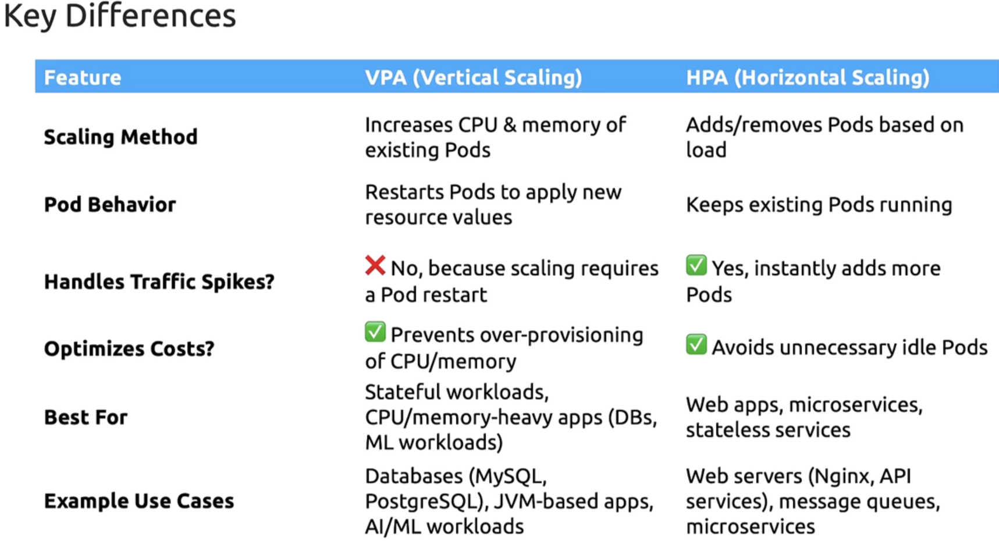</div>


# Cluster Maintenance

## OS Upgrading
- When we upgrade the OS of a node machine, that node will be temporarily unavailable to the cluster.
- If a node goes down, the controlplan waits 5 minutes before removing it from the cluster.
- The workload on this node will be rescheduled only if it is managed by a ReplicaSet or Deployment. (Standalone pods will not be recreated.)

- Best Practices:
  - Mark the node as Unschedulable
  - Drain the node from workload
  - Perform Maintenance
  - Allow scheduling again

```bash
kubectl cordon node1       
kubectl drain node1 --ignore-daemonsets --delete-emptydir-data  
kubectl uncordon node1      
```
- Note: When you run kubectl drain, these standalone pods will be deleted and not recreated, because there's no controller to manage or reschedule them.
  - Options for Handling These Pods:  Convert to a Deploy or replica / Manually Recreate 

## Cluster Upgrade & Releases

### Releases:
- `v1.33.2-beta`:
  - **1.**: Major Version
  - **.33.**: Minor
  - **.2**: Patch
  - releases: **alpha** (buggy), **beta** (stable)

- same releases cycles:
  - kube-apiserver 
  - controller-manager 
  - kube-scheduler
  - kube-proxy
  - kubelet
  - kubectl

<div style="text-align: center;">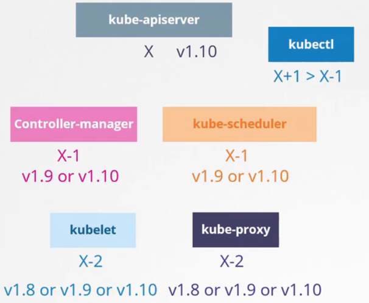</div>

### Cluster Upgrade

- Upgrade using kubeadm
  - Update Kubernetes apt repository
  - Install kubeadm updated version
  - kubeadm upgrade apply
  - upgrade the Kubelet

```bash
nano /etc/apt/sources.list.d/kubernetes.list
# deb [signed-by=/etc/apt/keyrings/kubernetes-apt-keyring.gpg] https://pkgs.k8s.io/core:/stable:/v1.33/deb/ /
apt update
# On Master
kubeadm upgrade plan                    # To See which versions need to be upgraded (k8s components)
apt-cache madison kubeadm               # See available updates for kubeadm
sudo apt upgrade kubeadm=1.33.3-1.1
kubeadm upgrade apply v1.33.3
sudo apt upgrade kubelet=1.33.3-1.1
sudo systemctl restart kubelet
# On Nodes
sudo apt upgrade kubeadm=1.33.3-1.1
sudo apt upgrade kubelet=1.33.3-1.1
kubeadm upgrade node 
sudo systemctl restart kubelet
```

## Backup and Restore Methods
- In order to Backup and restore our cluster and critical components:
  - Resource Configuration
  - ETCD Cluster
  - PVs
### Resource Configuration
- Save resources config files in SourceCode Repo
```bash
kubectl get all -A -o yaml > all-deploy-service.yaml 
```

### ETCD Cluster
- All data about nodes and resource is in the ETCD 
- Steps:
  - Create a snapshot
  - Check status
  - Restore 
  - Then update manifests/etcd.yaml to point to the newly restored directory
    - --data-dir /var/lib/etcd-from-backup
    - volumeMounts:mountPath: /var/lib/etcd-from-backup
    - volumes:hostPath:path: /var/lib/etcd-from-backup


```bash
# Take Snapshot of your ETCD
ETCDCTL_API=3 etcdctl \
  --endpoints=https://127.0.0.1:2379 \
  --cacert=/etc/kubernetes/pki/etcd/ca.crt \
  --cert=/etc/kubernetes/pki/etcd/server.crt \
  --key=/etc/kubernetes/pki/etcd/server.key \
  snapshot save /path/to/backup/etcd-backup.db 

ETCDCTL_API=3 etcdctl snapshot status etcd-backup.db  --write-out=table           # verify the snapshot

sudo ETCDCTL_API=3 etcdctl snapshot restore etcd-backup.db \
  --data-dir /var/lib/etcd \
  --endpoints https://127.0.0.1:2379 \
  --cacert /etc/kubernetes/pki/etcd/ca.crt \
  --cert /etc/kubernetes/pki/etcd/server.crt \
  --key /etc/kubernetes/pki/etcd/server.key

sudo nano /etc/kubernetes/manifests/etcd.yaml
# Then Edit the volumne mount to the new dir of backup restored
--cert-file=/etc/kubernetes/pki/etcd/server.crt
--data-dir=/var/lib/etcd
--key-file=/etc/kubernetes/pki/etcd/server.key
--listen-client-urls=https://127.0.0.1:2379,https://192.168.56.10:2379
--trusted-ca-file=/etc/kubernetes/pki/etcd/ca.crt
```


### Persistent Volume


# Security
- Security of Kube-apiserver `kubectl`
  - Who can access? *Authentication*
  - what they can do? *Authorization*
- Security of workloads
  - which pod can do what 
  - which pod can reach which pod

## Authentication
- Users
  - Static Password File --> username/password
  - Static Token File --> username/token
    - **Static Pass/Token Files**:
      - create user-details.csv *password/token,username,userid,groupid*
      - add it to kube-apiserver service by passing 
        - *--basic-auth-file=user-details.csv*
        - *--token-auth-file=user-details.csv*
  - Certificates
    - **Using Certificates**
      - sign a user certificate by the ca of the cluster 
      - then update the kubeconfig to use this cert
  - Identity service

- Bots (thirdParty)
  - ServiceAccount

### TLS Basics
- It built on Symmetric & Asymmetric Keys
- Public Key: *.crt, *.pem
- Private Key: *.key, *-key.pem

- > Three Main parts in the Secure Communication:
  - Central Authority CA
  - Client (kube-controller, kube-scheduler, kube-proxy, admin)
  - Server (kube-apiserver, etcdServer, kubelet)

<div style="text-align: center;">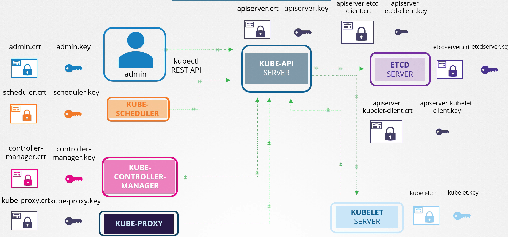</div>

```bash
# CA
openssl genrsa -out ca.key 2048                                       # Generate Private Key
openssl req -new -key ca.key -subj "/CN=KUBERNETES-CA" -out ca.csr    # Generate Sign Request
openssl x509 -req -in ca.csr -signkey ca.key -out ca.crt              # Sign the Cert

# Admin
openssl genrsa -out admin.key 2048                 # Generate Admin Private Key
openssl req -new -key admin.key -subj "/CN=kube-admin/O=system:masters" -out admin.csr   # Generate Sign Request
openssl x509 -req -in admin.csr -CA ca.crt -CAkey ca.key -out admin.crt                  # Sign admin cert

openssl x509 -in path/to/cert.crt -text -noout      # View Cert Details
```

###  Certificates API
- When a user need to be authenticated we should obtain signed cert by the ca of K8s 
- Steps:
  - User Create Key & Signing Request -> user.key & user.csr
  - Create `CertificateSigningRequest Object` 
    - Convert the csr to base64 then apply the object
  - Approve the csr
  - Then we obtain the cert from the approved CSR, Decode it then give it to the user

```yaml
apiVersion: certificates.k8s.io/v1
kind: CertificateSigningRequest
metadata:
  name: akshay
spec:
  groups:
  - system:authenticated
  request: <Paste the base64 encoded value of the CSR file>
  signerName: kubernetes.io/kube-apiserver-client
  usages:
  - client auth
```

```bash
kubectl get csr
kubectl certificate approve name of csr
kubectl certificate deny agent-smith
kubectl delete csr name-of-csr
```


### KubeConfig File
- Location: *$HOME/.kube/config*
- When using the kubectl command this command automatically use the kubeconfig file to authenticate you to the kubernetes api-server 
- this file consist of three sections:
  - Clusters: Clusters that you can access to
  - Users: useraccount with which you have access to this account
  - Contexts: define which user in `Users` can access which cluster in `Clusters` and which namespace to be in.

```yaml
apiVersion: v1
kind: Config
clusters:
- name: my-cluster
  cluster:
    server: https://api.my-cluster.example.com:6443
    certificate-authority: /etc/kubernetes/pki/ca.crt  # Path to CA cert
    # certificate-authority-data: <encoded cert>
users:
- name: my-user
  user:
    client-certificate: /etc/kubernetes/pki/users/my-user.crt
    client-key: /etc/kubernetes/pki/users/my-user.key
contexts:
- name: my-context
  context:
    cluster: my-cluster
    user: my-user
    namespace: default
current-context: my-context
```

- > Commands
```bash
kubectl config view
kubectl config --kubeconfig=/root/my-kube-config use-context research
vi ~/.bashrc
export KUBECONFIG=$HOME/my-kube-config
source ~/.bashrc
```

<div style="text-align: center;">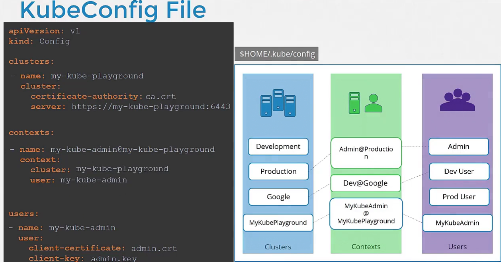</div>

### API Groups
- All resources in k8s are grouped into different 
  - Top level core api group `health`, `version`, `api`
  - next level Named api group that has versions that has resouces that has verbs to actions:
    - core --> named --> resources --> verbs
- To access kube-api server use kubectl proxy
```bash
kubectl proxy
```

## Authorization
- Node 
  - the authorization for a kubelet to read and write pods status
- ABAC
  - based on attributes
- Webhook
  - used external ThirdParty tool to check the authorization of the actions
- RBAC
  - based on roles
- `Role Based Access Control` *NameSpace Scope resources*: **Pods, PVC**
  - Create a Role: Define the (*name*, *apiGroup*, *resource*, *verbs* 'actions')
  - Create a RoleBinding: link the user to the specific role

```yaml
# role.yaml
apiVersion: rbac.authorization.k8s.io/v1
kind: Role
metadata:
  name: pod-reader
rules:
- apiGroups: [""]
  resources: ["pods"]
  verbs: ["get", "list", "watch"]
# rolebinding.yaml
apiVersion: rbac.authorization.k8s.io/v1
kind: RoleBinding
metadata:
  name: pod-reader-binding
subjects:
- kind: User
  name: dev-kary  
  apiGroup: rbac.authorization.k8s.io
roleRef:
  kind: Role
  name: pod-reader
  apiGroup: rbac.authorization.k8s.io

```
- `Role Based Access Control` *Cluster Scope resources or Across all namespaces*: **Nodes, PV**
  - Create a ClusterRole: Define the (*name*, *apiGroup*, *resource*, *verbs* 'actions')
  - Create a ClusterRoleBinding: link the user to the specific cluster role
```yaml
# clusterrole.yaml
apiVersion: rbac.authorization.k8s.io/v1
kind: ClusterRole
metadata:
  name: view-pods
rules:
- apiGroups: [""]
  resources: ["pods"]
  verbs: ["get", "list", "watch"]
# clusterrolebinding.yaml
apiVersion: rbac.authorization.k8s.io/v1
kind: ClusterRoleBinding
metadata:
  name: view-pods-binding
subjects:
- kind: User
  name: dev-user               # Must match CN in user cert
  apiGroup: rbac.authorization.k8s.io
roleRef:
  kind: ClusterRole
  name: view-pods
  apiGroup: rbac.authorization.k8s.io
```

- To give admin access:
```yaml
apiVersion: rbac.authorization.k8s.io/v1
kind: ClusterRoleBinding
metadata:
  name: dev-kary-admin-binding
subjects:
- kind: User
  name: dev-kary
  apiGroup: rbac.authorization.k8s.io
roleRef:
  kind: ClusterRole
  name: cluster-admin
  apiGroup: rbac.authorization.k8s.io
```

- Commands:
```bash
kubectl create role developer --namespace=default --verb=list,create,delete --resource=pods
kubectl create rolebinding dev-user-binding --namespace=default --role=developer --user=dev-user
```


## ServiceAccount
- **ServiceAccount** is the authentication and authorization for a service like `Prometheus`
  - From v1.24+, we create a sa then we use TokenRequest API to create a bounded LifeTime
  - To Create a long nonexisting token --> create a secret object and link it to serviceaccount
- After Create ServiceAccount and create token by `TokenRequest`, then we define service account in pod deification and it automatically create volume to mount the secret token inside of Projected Volumes
  
```bash

kubectl create serviceaccount mac           # Create ServiceAccount
# Create role & RoleBinding with right permissions
kubectl create token mac --duration=3600s --namespace=default # Create Token 
```

## ImageSecurity
- we can specify a private repo for pulling images
- we first create a secret called docker-registry (`server`, `username`, `password`, `email`)
- specify the secret in the container definition
```bash
kubectl create secret docker-registry my-dockerhub-secret \
  --docker-server=https://index.docker.io/v1/
  --docker-username=YOUR_DOCKERHUB_USERNAME \
  --docker-password=YOUR_PASSWORD_OR_TOKEN \
  --docker-email=YOUR_EMAIL \
```
- At resource manifest:

```yaml
apiVersion: v1
kind: Pod
metadata:
  name: my-private-image-pod
spec:
  containers:
  - name: my-container
    image: yourusername/your-private-image:tag
  imagePullSecrets:
  - name: my-dockerhub-secret
```

## Security Context
- use securityContext
- We can define securityContext on container level or pod level
- To update the security context of a pod we should delete the pod and recreate it
```yaml
securityContext:
  runAsUser: 1000
  runAsGroup: 3000
  runAsNonRoot: true
  capabilities:              # Only for container level
    add: ['MAC_ADMIN']

```

## NetworkPolicy
- Networkpolicy controls the traffic between your components, It permits who talk to who.
- Two type of policies (***We determine which type based on the request flow "who will speak to who"***):
  - Ingress `From outside in`
  - Egress `From inside out`
- Note: the response dent need a separate rule.
- When we define network policy:
  - we first determine the pod that want to apply the rule on by `spec.podSelector` part.
  - Then we determine witch `policyType` to be Ingress or Egress
  - Then we define the `ingress` or `egress` and define `from`, `ports`
  - Inside the from, we define rules, if traffic meet one of them then it pass 
    - each rule can has multiple conditions as `AND` gate.
    - all rules as as `OR` gate for the request.

```yaml
apiVersion: networking.k8s.io/v1
kind: NetworkPolicy
metadata:
  name: allow-frontend-to-backend
  namespace: my-app
spec:
  podSelector:
    matchLabels:
      app: backend
  policyTypes:
  - Ingress
  ingress:
  - from:
    - podSelector:              # This a rule that has two parts (podselector + namespaceselector)
        matchLabels:
          app: frontend
      namespaceSelector:
        matchLabels:
          name: prod
    - ipBlock:                  # This is another rule that if it meets, then traffic will go through 
        cidr: 172.17.0.0/16
        except:
        - 172.17.1.0/24
    ports:
    - protocol: TCP
      port: 6379
```

## Custom Resource Definition (CRD) 
- `Custom resource`: It is an extension of the Kubernetes API that is not necessarily available in a default Kubernetes installation.

- when we need a new resourse that can provide us certen fuction we can do this by `CRD`
- to make this actually work we need to define custom controller in `GO`

- Operator Framework: is the combination between `CRDs` & `Custom Controller` 

<div style="text-align: center;">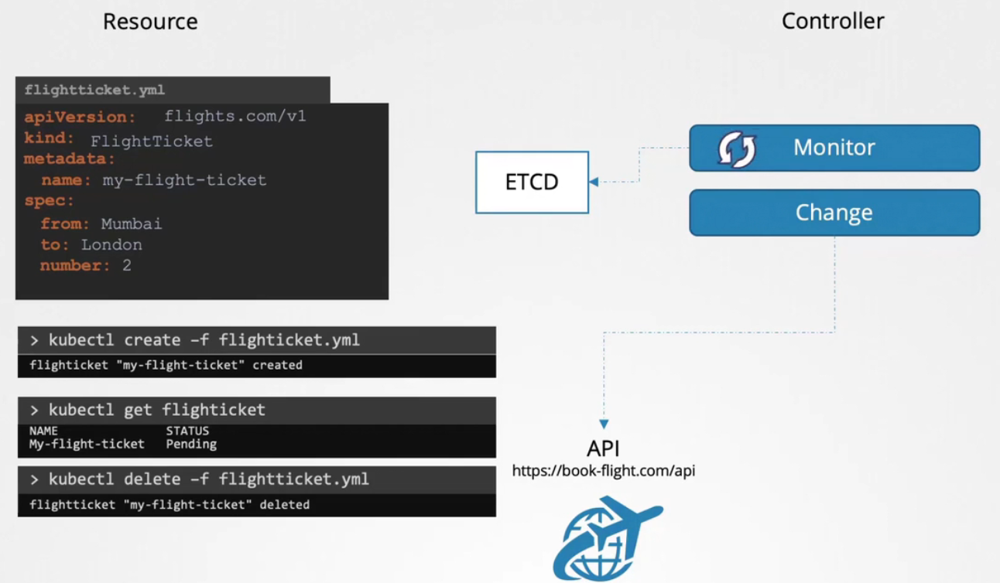</div>

```yaml
---
apiVersion: apiextensions.k8s.io/v1
kind: CustomResourceDefinition
metadata:
  name: internals.datasets.kodekloud.com 
spec:
  group: datasets.kodekloud.com
  scope: Namespaced 
  names:
    plural: internals
    singular: internal
    kind: Internal
    shortNames:
    - int
  versions:
    - name: v1
      served: true
      storage: true
      schema:
        openAPIV3Schema:
          type: object
          properties:
            spec:
              type: object
              properties:
                internalLoad:
                  type: string
                range:
                  type: integer
                percentage:
                  type: string
```

# Storage

## Docker Storage
- Docker use volume drivers for storage
- Storage Drivers: AUFS, Device Mapper, Overlay 
  - Container layer filesystem Storage
  - Uses copy-on-write (CoW)
  - Tied to container

- Volume Drivers: local, nfs, aws/efs
  - Persistent, external data
  - Independent of container

- Layered Docker Architecture
  - Image layers --> read-only
  - container layer --> read-write (ephemeral) "Use Storage Driver"
  - Mount volume (Persistent) "Use Volume Driver"

```text
/var/lib/docker
|- aufs
|- containers
|- images
|- volumes
```

## Container Storage Interface `CSI`
- User creates a PersistentVolumeClaim (PVC)
- Kubernetes finds a matching StorageClass
- The external-provisioner calls CreateVolume on the CSI driver
- A PersistentVolume (PV) is created and bound to the PVC
- When a Pod is scheduled:
  - kubelet contacts CSI’s Node Plugin
  - NodePublishVolume is called to attach/mount the volume
  - When Pod is deleted, NodeUnpublishVolume and optionally DeleteVolume are called

## Volumes
- A Kubernetes Volume is a directory accessible to containers in a Pod.
- Persist data beyond the container’s lifetime 

| Type      | Persistent | Use Case    |
| --------- | ---------- | ---------- |
| **emptyDir**  | ❌ (deleted when Pod is deleted)     | Temporary scratch space between containers in the same Pod |
| **hostPath**    | ❌/✅ (depends, but tied to the node) | Access node’s filesystem         |
| **configMap**     | N/A (stores config, not app data)   | Mount config files into Pods       |
| **secret**   | N/A      | Mount sensitive data into Pods                    |
| **PersistentVolume (PV)** + **PersistentVolumeClaim (PVC)** | ✅    | Pod storage independent of Pod lifecycle  |
| **projected**    | N/A      | Combine several sources (ConfigMap, Secret, Downward API) into one mount |


## Persistent Volumes (PV) & Persistent Volume Claims (PVC)
### PV
- A cluster-wide resource that represents physical storage (disk, NFS, cloud storage).
- Created by admins.

### PVC
- A request for storage by a user.
- Tied to a PV via:
- Access Modes:
  - ReadWriteOnce (RWO) – one node read/write
  - ReadOnlyMany (ROX) – multiple nodes read-only
  - ReadWriteMany (RWX) – multiple nodes read/write

- StorageClass – defines dynamic provisioning.
- Static provisioning → admin creates PV, user creates PVC, scheduler binds.
- Dynamic provisioning → PVC requests storage class, PV is created automatically.

```yaml
---
    volumeMounts:
    - mountPath: /log
      name: log-volume

  volumes:
  - name: log-volume
    hostPath:
      # directory location on host
      path: /var/log/webapp
      # this field is optional
      type: Directory
  - name: log-volume
  persistentVolumeClaim:
    claimName: claim-log-1
---
apiVersion: v1
kind: PersistentVolume
metadata:
  name: pv-log
spec:
  persistentVolumeReclaimPolicy: Retain
  accessModes:
    - ReadWriteMany
  capacity:
    storage: 100Mi
  hostPath:
    path: /pv/log
---
kind: PersistentVolumeClaim
apiVersion: v1
metadata:
  name: claim-log-1
spec:
  accessModes:
    - ReadWriteOnce
  resources:
    requests:
      storage: 50Mi
---
```

## StorageClass


# Networking

## Prerequisite 
- In order to fully understand K8s networking you need to cover this topics:
  - Switching, Routing, Gateways CNI in kubernetes
  - DNS
  - Network Namespaces 


# Design a Kubernetes Cluster
## Considerations
- Purpose (*dev / prod*)
- Cloud or OnPrem
- Type/size of Workload
- Number of Nodes (*Masters / Workers*)

## Configure High Availability
- When configuring HA Cluster we need to eliminate any single point of failure in our setup.
- We should relay on more than one `Master Node`
  - `Load Balancing` for **API-Servers** (*Active-Active*)
  - **Controller Manager & Scheduler** will elect leader (*Active-Standby*)
  - **ETCD** (*Stacked etcd VS External etcd*) 

## ETCD in HA
- ETCD is a distributed Key/Value Store.
- It can have many instance that can perform read/write 
- It ensures that same consistent copy of the data is available on all instances
- For the `Write Porcess` only the leader instacne is responsible for handling the writes 
  - After the leader done with the write, it sends copy of the data to the rest.
  - If write came to worker etcd instacne, it forward the request to the leader instance.
  - The write consider completed if it is replicated to others.  
- To Ensure this process, *The Leader Election - RAFT Protocl* is used 

<div style="text-align: center;">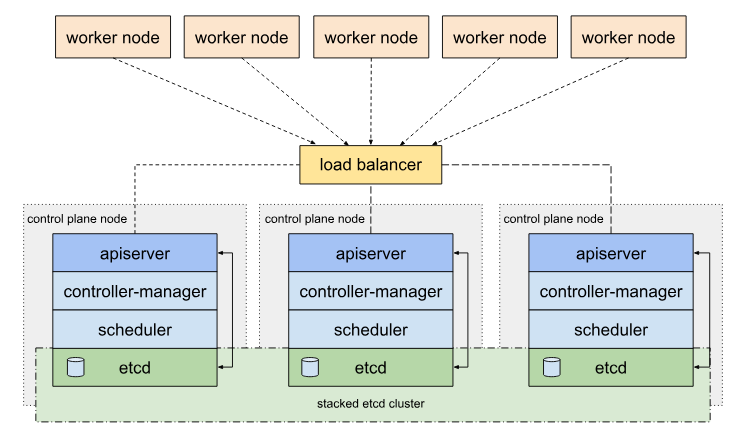</div>
<div style="text-align: center;">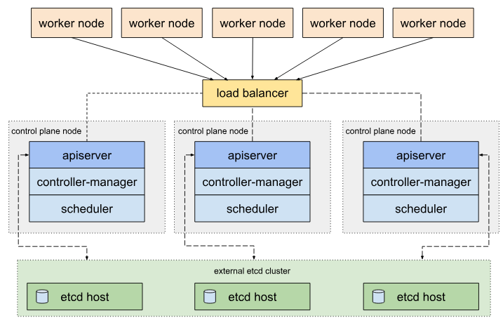</div>


### > `Quorum is the minimum number of members in a distributed system that must agree or be available to make decisions. Quorum = (N/2 + 1) - Odd Number is prefered`

<div style="text-align: center;">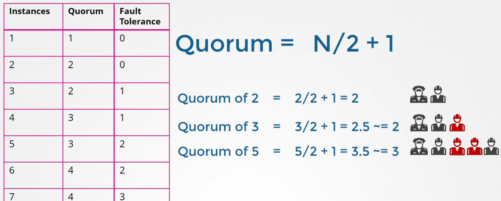</div>

## Resoruces 
- https://www.youtube.com/watch?v=uUupRagM7m0&list=PL2We04F3Y_41jYdadX55fdJplDvgNGENo
- https://github.com/mmumshad/kubernetes-the-hard-way
- https://kubernetes.io/docs/setup/production-environment/tools/kubeadm/ha-topology/
- https://kubernetes.io/docs/setup/production-environment/tools/kubeadm/high-availability/ 

# Helm & Kustomize

# Advanced Kubectl Commands
- To retrive info using kubectl in advanced way we use `JSONPATH` & `CUSTOM-COLUMNS`
  - **-o=jsonpath** & **-o=custom-columns=<Col-name>:<JsonPath>**
  - **--sort-by=**


```bash
kubectl get nodes -o=jsonpath='{.items[*].metadata.name}'
kubectl get nodes -o jsonpath='{.items[*].status.nodeInfo.osImage}'
kubectl get po -o=custom-columns=PODs:.metadata.name
kubectl get pv --sort-by=.spec.capacity.storage 
```

# General CLI
```bash
etcdctl backup
etcdctl cluster-health
etcdctl mk
etcdctl mkdir
etcdctl set
etcdctl snapshot save
etcdctl endpoint health
etcdctl get
etcdctl put
```

# Kubectl Commands
```bash
kubectl run nginx --image=nginx
kubectl create deployment --image=nginx nginx
kubectl create deployment --image=nginx nginx --dry-run=client -o yaml
kubectl create deployment --image=nginx nginx --dry-run=client -o yaml > nginx-deployment.yaml
kubectl create -f nginx-deployment.yaml
kubectl create deployment --image=nginx nginx --replicas=4 --dry-run=client -o yaml > nginx-deployment.yaml
kubectl scale deployment nginx--replicas=4
kubectl expose pod redis --port=6379 --name redis-service --dry-run=client -o yaml
kubectl create service clusterip redis --tcp=6379:6379 --dry-run=client -o yaml 
kubectl create service nodeport nginx --tcp=80:80 --node-port=30080 --dry-run=client -o yaml

kubectl logs -f podname container 

kubectl replace --force -f nginx.yaml

kubectl set image deploy/deployname containername=newimage      # Update live deployment not the file
```

# Notes


# Never Forget Commands
```bash

kubectl logs -f podname container             # Show Logs
kubectl label po podname env=prod
kubectl get all -l env=prod,bu=finance        # Get resources with certain labels
kubectl get po --show-labels
```


# TODO
https://www.youtube.com/watch?v=qRPNuT080Hk
https://github.com/etcd-io/website/blob/main/content/en/docs/v3.5/op-guide/recovery.md


Kubectx
With kubectx, you don't have to use lengthy kubectl config commands to switch between contexts. This tool is particularly useful for switching between clusters in a multi-cluster environment.

Kubens
This tool allows users to switch between namespaces quickly with a simple command.


# Services & Networking (20 %)

## Service 
- a way of exposing a connection to pods (consistent & reliable)
- we use selector to selelct which pods we want to route the traffic to
  - an automatic endpointslice created to points to the pods ip that match the selector labels
- A Service without a selector lets you manually control where traffic goes, instead of Kubernetes automatically picking pods for you.

- Service -> EndpointSlice (Custom || Automated) -> Pod's IP -> Pod

- we can define mulitple port to these pods 
```yaml
spec:
  ports:
    - name: http
      protocol: TCP
      port: 80
      targetPort: 9376
    - name: https
      protocol: TCP
      port: 443
      targetPort: 9377
```

- [`SEC NOTE`]: 
  - You cannot use kubectl port-forward on a Service that has no selector (and therefore, no pods behind it).
  - This prevents the Kubernetes API server from being used as a proxy to endpoints the caller may not be authorized to access.


### Types
- `type: ClusterIP`
  - default Service type assigns an IP address from cluster pool
  - Several of the other types for Service build on the ClusterIP type as a foundation.
  - .spec.clusterIP set to "None" then Kubernetes does not assign an IP address ***headless Services***

- `type: NodePort`
  - default range: 30000-32767 (upper for automatic assign/ lower for manual "avoid collisions")
  - Custom IP address configuration: 
    - a NodePort Service listens on every IP of your node. IPs(private internal network, Lan, localhost)
    - We can use a flag `--nodeport-addresses=10.0.0.0/8,192.168.1.0/24` to make our NodePort will only listen on this ip ranges & ignore other (localhost)
- `type: Loadbalancer`
  - Use ClusterIP and NodePort in this type, and it integrate with cloud provider for the loadbalancer config and setup
- `type: ExternalName`
  - Used to resolve a service to a DNS record not IP addreses

### Headless service
- No ClusterIP is assigned (hence “headless” — no virtual front).
- When you look up the Service in DNS, it directly returns the IP addresses of the backend Pods.
- The client connects directly to a Pod’s IP, bypassing kube-proxy and the virtual load balancer.

### Endpointslices

```yaml
apiVersion: discovery.k8s.io/v1
kind: EndpointSlice
metadata:
  name: my-service-1 # by convention, use the name of the Service
                     # as a prefix for the name of the EndpointSlice
  labels:
    # You should set the "kubernetes.io/service-name" label.
    # Set its value to match the name of the Service
    kubernetes.io/service-name: my-service
addressType: IPv4
ports:
  - name: http # should match with the name of the service port defined above
    appProtocol: http
    protocol: TCP
    port: 9376
endpoints:
  - addresses:
      - "10.4.5.6"
```

## Ingress & Ingress Controller
<div style="text-align: center;"></div>

- An Ingress is a layer 7 (HTTP/HTTPS) router that manages external access to Services within the cluster.
- To route external HTTP(S) traffic to multiple Services based on hostnames and paths.
- Act as a reverse proxy

## Gateway API

## Network Policies

## pod-to-pod & CoreDNS