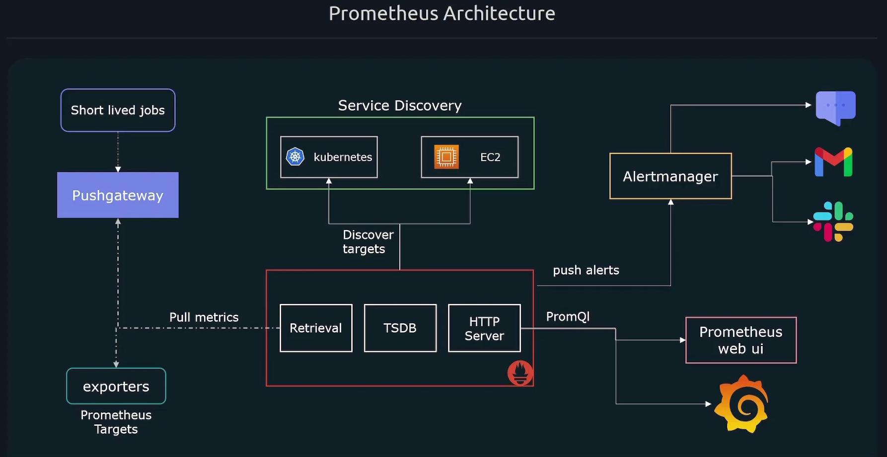

# Kubernetes and Cloud-Native Associate (KCNA)
## Table of Contents

- [Curriculum](#curriculum)
- [Kubernetes Fundamentals](#kubernetes-fundamentals)
- [Container Orchestration Security](#security)
- [Container Orchestration Networking](#networking)
- [Container Orchestration Storage](#storage)
- [Cloud Native Architecture](#cloud-native-architecture)
- [Cloud Native Observability](#cloud-native-observability)
- [Cloud Native Application Delivery](#cloud-native-application-delivery)
- [Kubectl Commands](#kubectl-commands)
- [Notes](#notes)

## Curriculum
<details>
  <summary><strong>Kubernetes Fundamentals (46%)</strong></summary>
  <ul>
    <li>Kubernetes Resources  </li>
    <li>Kubernetes Architecture</li>
    <li>Kubernetes API</li>
    <li>Containers</li>
    <li>Scheduling</li>
    </ul>
</details>
<details>
  <summary><strong>Container Orchestration (22%)</strong></summary>
  <ul>
  <li> Container Orchestration Fundamentals  </li>
  <li> Runtime  </li>
  <li> Security  </li>
  <li> Networking  </li>
  <li> Service Mesh  </li>
  <li> Storage  </li>
  </ul>
</details>
<details>
  <summary><strong>Cloud Native Architecture (16%)</strong></summary>
  <ul>
  <li> Autoscaling  </li>
  <li> Serverless  </li>
  <li> Community and Governance  </li>
  <li> Roles and Personas  </li>
  <li> Open Standards  </li>
  </ul>
</details>
<details>
  <summary><strong>Cloud Native Observability (8%)</strong></summary>
  <ul>
  <li> Telemetry & Observability  </li>
  <li> Prometheus  </li>
  <li> Cost Management  </li>
  </ul>
</details>
<details>
  <summary><strong>Cloud Native Application Delivery (8%)</strong></summary>
  <ul>
  <li> Application Delivery Fundamentals  </li>
  <li> GitOps  </li>
  <li> CI/CD  </li>
  </ul>
</details>

## Kubernetes Fundamentals

### Kubernetes Architecture
#### Control Plane Components (Master)
| Component     | Description  |
| --------------| ------------ |
| **API Server**| Act as frontend to for k8s, for managing cluster using CLI `kubectl`|
| **etcd**      | Key-value store. Persists all cluster state and configuration.|
| **Scheduler** | Assigns new pods to nodes.|
| **Controller**| brain behind noticing down pod or unhealthy nodes|
| **kube-proxy** | Handles networking rules, service discovery, and load balancing.|
####  Node (Worker) Components
| Component     | Description  |
| --------------| ------------ |
| **kubelet** | Agent on each node. Communicates with API server. Manages pod lifecycle. |
| **Container Runtime Interface CRI** | underline software to runs containers `containerd`,`CRI-O`.|
| **Container Network Interface CNI**  | Implements container networking `Calico`.|
| **kube-proxy** | Handles networking rules, service discovery, and load balancing.|

### Container Runtime Interface CRI
- kubernetes was originally working with docker only as container runtime 
- then kubernetes introduce Container Runtime Interface to let be able to work with other container runtime without code change
- The CRI defines the gRPC Protocol that kubernetes kubelet uses to interact with container runtime
- Any container runtime can work on kubernetes should follow the open container Imitative OCI
- *Open Container Imitative* `OCI`: 
    - imagespec: how image should be build 
    - runtimespec: how container runtime should be build 
- Docker don't has CRI so it used Dockershim for a while then it removed duo to it's mentinants burdens then docker removed but Docker images are still fully supported.
- Kubernetes now uses Containerd or CRI-O under the hood.
#### Containerd
- Containerd is CRI constable and part of docker components
- **ctr**: containerd CLI not user friendly and  support limited features, only for debugging
- **nerdctl**: 
    - Support docker compose
    - Same as docker command  
    - Many features (lazy pulling, namespace, encrypt images P2P image distribution)
    - *`P2P image distribution`*: Strategy of distributing container images across nodes without relying entirely on a central image registry 
- **crictl**: 
    - for debugging and inspect
    - works across different runtime
    - 

<!-- ### Resources -->
 

### Scheduling

#### Manual Scheduling
- Each pod got assigned to a node while creation 
- This add field called `nodeName` in pod **Spec**
- What schedule do?
  - It goes for all pods that has no nodeName set and then decide which node to assign this pod to by an algorithm
  - Then the scheduler do *Bind Pod to Node* by creating a binding object
- You can't modify the node of the pod assigned by directly using `nodeName` 
- You can do it by creating pod Binding to the target node

```yaml
apiVersion: v1
kind: Binding 
metadata:
  name: binding_name
target:
  apiVersion: v1
  kind: Node
  name: node_name
```

#### Labels & Selectors & Annotations
- Standard matter to group things together 
- Used to match the target pods controlled by ReplicaSet or Deployment or Service
##### Labels
- Properties attache to each item
```yaml
apiVersion: v1
kind: Service
metadata:
  name: my-service 
  Labels:
    app: app1
    function: Backend
    tier: db
```

##### Selectors 
- Help you to filter these items
- By Impeditive way, CLI for debugging:
```bash
kubectl get pod --selector app=app1
kubectl get pod -l app=app1

```
- By Declarative way, Manifests:
```yaml
apiVersion: apps/v1
kind: Deployment
metadata:
  name: app-deployment
spec:
  replicas: 5
#--------------------- this section
  selector:         #-
    matchLabels:    #-   
      tier: app     #-
#---------------------
  template:
    metadata:
#--------------------- Match this section
      labels:       #-
        tier: app   #-
#--------------------- 
    spec:
      containers:
        - name: nodejs
```

##### Annotations 
- Annotations = extra info, not used for filtering
- Useful for tools, configs, custom logic

```yaml
annotations:
  prometheus.io/scrape: "true"
  prometheus.io/port: "9090"
```


#### Taints & Toleration
- Set restriction on which pod will be schedule on which node 
  - Taints --> Nodes 
  - Toleration --> Pods
- `Tainting` a Node with high resources for critical workload
  - **Taint-effect**: *what will happen to pods what do not tolerate this taint?*
    - *NoSchedule*: this pod will not be scheduled on this node
    - *PreferNoSchedule*: System will try to avoid to schedule the pod on this node
    - *NoExecute*: affects pods that are already running on the node, Pods that do not tolerate the taint are evicted

```bash
kubectl taint nodes node node_name key=value:taint-effect # add taint
kubectl taint nodes node1 key1=value1:NoSchedule-         # remove taint
```
- `Tolerating` a Pod:
  - Edit the pod definition file
```yaml
apiVersion: v1
kind: Pod
metadata:
  name: my-pod
spec:
  containers:
  - name: nginx
    image: nginx
  tolerations:
  - key: "app"
    operator: "Equal"
    value: "blue"
    effect: "NoSchedule"
      
```

#### Node Selector
- We can label nodes with key/value pair to schedule specific pod "high computing consumption" to Node with "High resources"
- First label a node:
```bash
kubectl label nodes node_name key=value
```
- Edit pod file:
```yaml
apiVersion: v1
kind: Pod
metadata:
  name: my-pod
spec:
  containers:
  - name: nginx
    image: nginx
  nodeSelector:
    size: Large
```
- **Node Selector has limitation that will be overcome in Node Affinity**

#### Node Affinity
- Scheduling pod based on conditions
- Using terms to match which node to be schedule on 
- Ex: schedule the pod on a node that has label size and the value is not Small
```yaml
spec:
  containers:
    - name: data-processor
      image: data-processor
  affinity:
    nodeAffinity:
      requiredDuringSchedulingIgnoredDuringExecution:
        nodeSelectorTerms:
          - matchExpressions:
              - key: size
                operator: NotIn
                values:
                  - Small
```

#### Resource Limit
- Requests: This is the minimum amount of CPU or memory that a container needs.
- Limits: This is the maximum amount of CPU or memory a container can use.
- If pod needs more:
  - For memory: It is killed (OOMKilled).
  - For CPU: It is throttled (slowed down), not killed.
```yaml
resources:
  requests:
    memory: "256Mi"
    cpu: "250m"
  limits:
    memory: "512Mi"
    cpu: "500m"
```
- Best options to use may be one of this:
  - Define Requests & Limits 
  - Define Requests & No Limits

- **`LimitRange`**: sets default and maximum resource limits/requests for containers or pods in a namespace.
  - `default`: default limits if not specify
  - `defaultRequest`: default Rrequests if not specify
  - `min`: lower bound *cannot request or limit less than this*
  - `max`: upper bound *cannot request or limit more than this*
```yaml
apiVersion: v1
kind: LimitRange
metadata:
  name: resource-limits
  namespace: my-namespace
spec:
  limits:
    - default:
        cpu: 500m
        memory: 512Mi
      defaultRequest:
        cpu: 200m
        memory: 256Mi
      max:
        cpu: 1
        memory: 1Gi
      min:
        cpu: 100m
        memory: 128Mi
      type: Container
```

- **`ResourceQuota`**: Limits the total amount of resources *CPU*, *memory*, *pods*, *PVCs* that can be used in a namespace.  
```yaml
apiVersion: v1
kind: ResourceQuota
metadata:
  name: dev-quota
  namespace: dev
spec:
  hard:
    requests.cpu: "2"
    requests.memory: "4Gi"
    limits.cpu: "4"
    limits.memory: "8Gi"
    pods: "10"
    persistentvolumeclaims: "5"
```

#### DaemonSet
- Same as deployment or replicaSet but it will deploy a pod in each node in the cluster

#### StaticPods
- If we have a node that is not part of cluster
- We want to run pods in this node *we dent have kube-api/kubectl* 
- we put pods manifests in a path that defined to kubelet to manage it by itself
- Path is defined in kubelet service *--pod-manifest-path*, *config=kubeconfig.yaml*
- Same way the Kubeadm works *putting mainfests of the master control components in the path of kubelet*
  - `Deploy Control Plane Components as Static Pods` **^~\_Kubeadm_/~^**
- It ignored by scheduler

#### Multiple Schedulers

#### Configuring Kubernetes Scheduler Profiles
- Stages *Plugins* that a Pod get thorough to be scheduled:
  - Scheduling Queue:
    - PrioritySort 
  - Filtering:  
    - NodeResourceFit
    - NodeName
    - NodeUnschedule  
    - TaintToleration
  - Scoring: 
    - ImageLocality
    - TaintToleration
    - NodeAffinity
  - Binding: 
    - DefaultBinder


## Container Orchestration

### Security
- Security of Kube-apiserver `kubectl`
  - Who can access? *Authentication*
  - what they can do? *Authorization*
- Security of workloads
  - which pod can do what 
  - which pod can reach which pod

#### Authentication
- Users
  - Static Password File --> username/password
  - Static Token File --> username/token
    - **Static Pass/Token Files**:
      - create user-details.csv *password/token,username,userid,groupid*
      - add it to kube-apiserver service by passing 
        - *--basic-auth-file=user-details.csv*
        - *--token-auth-file=user-details.csv*
  - Certificates
    - **Using Certificates**
      - sign a user certificate by the ca of the cluster 
      - then update the kubeconfig to use this cert
  - Identity service

- Bots (thirdParty)
  - ServiceAccount
---
##### KubeConfig File
- Location: *$HOME/.kube/config*
- When using the kubectl command this command automatically use the kubeconfig file to authenticate you to the kubernetes api-server 
- this file consist of three sections:
  - Clusters: Clusters that you can access to
  - Users: useraccount with which you have access to this account
  - Contexts: define which user in `Users` can access which cluster in `Clusters` and which namespace to be in.

```yaml
apiVersion: v1
kind: Config
clusters:
- name: my-cluster
  cluster:
    server: https://api.my-cluster.example.com:6443
    certificate-authority: /etc/kubernetes/pki/ca.crt  # Path to CA cert
users:
- name: my-user
  user:
    client-certificate: /etc/kubernetes/pki/users/my-user.crt
    client-key: /etc/kubernetes/pki/users/my-user.key
contexts:
- name: my-context
  context:
    cluster: my-cluster
    user: my-user
    namespace: default
current-context: my-context
```

##### API Groups
- All resources in k8s are grouped into different 
  - Top level core api group `health`, `version`, `api`
  - next level Named api group that has versions that has resouces that has verbs to actions:
    - core --> named --> resources --> verbs
- To access kube-api server use kubectl proxy
```bash
kubectl proxy
```

#### Authorization
- Node 
  - the authorization for a kubelet to read and write pods status
- ABAC
  - based on attributes
- Webhook
  - used external ThirdParty tool to check the authorization of the actions
- RBAC
  - based on roles
- `Role Based Access Control` *NameSpace Scope resources*: **Pods, PVC**
  - Create a Role: Define the (*name*, *apiGroup*, *resource*, *verbs* 'actions')
  - Create a RoleBinding: link the user to the specific role

```yaml
# role.yaml
apiVersion: rbac.authorization.k8s.io/v1
kind: Role
metadata:
  name: pod-reader
rules:
- apiGroups: [""]
  resources: ["pods"]
  verbs: ["get", "list", "watch"]
# rolebinding.yaml
apiVersion: rbac.authorization.k8s.io/v1
kind: RoleBinding
metadata:
  name: pod-reader-binding
subjects:
- kind: User
  name: dev-kary  
  apiGroup: rbac.authorization.k8s.io
roleRef:
  kind: Role
  name: pod-reader
  apiGroup: rbac.authorization.k8s.io

```
- `Role Based Access Control` *Cluster Scope resources or Across all namespaces*: **Nodes, PV**
  - Create a ClusterRole: Define the (*name*, *apiGroup*, *resource*, *verbs* 'actions')
  - Create a ClusterRoleBinding: link the user to the specific cluster role
```yaml
# clusterrole.yaml
apiVersion: rbac.authorization.k8s.io/v1
kind: ClusterRole
metadata:
  name: view-pods
rules:
- apiGroups: [""]
  resources: ["pods"]
  verbs: ["get", "list", "watch"]
# clusterrolebinding.yaml
apiVersion: rbac.authorization.k8s.io/v1
kind: ClusterRoleBinding
metadata:
  name: view-pods-binding
subjects:
- kind: User
  name: dev-user               # Must match CN in user cert
  apiGroup: rbac.authorization.k8s.io
roleRef:
  kind: ClusterRole
  name: view-pods
  apiGroup: rbac.authorization.k8s.io
```

- To give admin access:
```yaml
apiVersion: rbac.authorization.k8s.io/v1
kind: ClusterRoleBinding
metadata:
  name: dev-kary-admin-binding
subjects:
- kind: User
  name: dev-kary
  apiGroup: rbac.authorization.k8s.io
roleRef:
  kind: ClusterRole
  name: cluster-admin
  apiGroup: rbac.authorization.k8s.io
```

#### ServiceAccount
- **ServiceAccount** is the authentication and authorization for a service like `Prometheus`
  - From v1.24+, we create a sa then we use TokenRequest API to  create a bounded LifeTime
  - To Create a long nonexisting token --> create a secret object and link it to serviceaccount
  
```bash
kubectl create serviceaccount mac
kubectl create token mac --duration=3600s --namespace=default
```

#### ImageSecurity
- we can specify a private repo for pulling images
- we first create a secret called docker-registry (`server`, `username`, `password`, `email`)
- specify the secret in the container definition
```bash
kubectl create secret docker-registry my-dockerhub-secret \
  --docker-server=https://index.docker.io/v1/
  --docker-username=YOUR_DOCKERHUB_USERNAME \
  --docker-password=YOUR_PASSWORD_OR_TOKEN \
  --docker-email=YOUR_EMAIL \
```
- At resource manifest:

```yaml
apiVersion: v1
kind: Pod
metadata:
  name: my-private-image-pod
spec:
  containers:
  - name: my-container
    image: yourusername/your-private-image:tag
  imagePullSecrets:
  - name: my-dockerhub-secret
```

#### Security Context
- use securityContext
```yaml
securityContext:
  runAsUser: 1000
  runAsGroup: 3000
  runAsNonRoot: true
```

#### NetworkPolicy
```yaml
apiVersion: networking.k8s.io/v1
kind: NetworkPolicy
metadata:
  name: allow-frontend-to-backend
  namespace: my-app
spec:
  podSelector:
    matchLabels:
      app: backend
  policyTypes:
    - Ingress
  ingress:
    - from:
        - podSelector:
            matchLabels:
              app: frontend
```

### Networking
- Every service within the namespace can be called without the ns 
  - connect('dbservice')  --> svcName
  - connect('dbservice.db') --> svcName.ns
  - ('dbservice.db.svc.cluster.local') --> svcName.ns.svc.cluster.local 
- Pod can be reached using IP "If explicit"
  - ('10-244-1-2.dev.pod.cluster.local')--> ip-in-dash.na.pod.cluster.local

### Service Mesh
- SideCar: small container beside your app container to serve it as proxy and logging etc
- Envoy: Proxy Sidecar Container developed by LYFT for microservice mesh 


### Storage

#### Docker Storage
- Docker use volume drivers for storage
- Storage Drivers: AUFS, Device Mapper, Overlay 
  - Container layer filesystem 
  - Uses copy-on-write (CoW)
  - Tied to container

- Volume Drivers: local, nfs, aws/efs
  - Persistent, external data
  - Independent of container

- Layered Docker Architecture
  - Image layers --> read-only
  - container layer --> read-write (ephemeral) "Use Storage Driver"
  - Mount volume (Persistent) "Use Volume Driver"

```text
/var/lib/docker
|- aufs
|- containers
|- images
|- volumes
```

#### Container Storage Interface `CSI`
- User creates a PersistentVolumeClaim (PVC)
- Kubernetes finds a matching StorageClass
- The external-provisioner calls CreateVolume on the CSI driver
- A PersistentVolume (PV) is created and bound to the PVC
- When a Pod is scheduled:
  - kubelet contacts CSI’s Node Plugin
  - NodePublishVolume is called to attach/mount the volume
  - When Pod is deleted, NodeUnpublishVolume and optionally DeleteVolume are called


## Cloud Native Architecture 

### AutoScaling
- Automatic: Increase the ability to handel the workload or decrease it
- Bidirectional: Scale up and Down

#### Horizontal Pod Scaling
- Add more units *Pods*
- `HorizontalPodAutoscaler`:
  - scale a Deployment up and down by replicas number
  - Take from a metrics server info about pods and nodes resources utilization  
  - Based on a threshold or a condition it will triger the `HPA` to add/remove replicas
```yaml
apiVersion: autoscaling/v2
kind: HorizontalPodAutoscaler
metadata:
  name: nginx-hpa
spec:
  scaleTargetRef:
    apiVersion: apps/v1
    kind: Deployment
    name: nginx-deployment
  minReplicas: 1
  maxReplicas: 5
  metrics:
  - type: Resource
    resource:
      name: cpu
      target:
        type: Utilization
        averageUtilization: 50
```

#### Vertical Pod Scaling
- Add more resources to a unit *CPUs & Memory of Pods*
- Adjust the amount of resource assigned to the resource based on condition
- Components:
  - VPA Recommender: Look for metrics server that watch resource utilization and defined Limits/requests then output a resource recommendation 
  - VPA Updater: check if the resource recommendation == resource allocation, based on `updateMode`  if it's mismatch and updateMode = Auto it will evict the pod 
  - VPA Admission Controller: intercept the new pod creation and update the resource definition to match the recommendation 
- Deploy VPA to managed Cluster
```bash
git clone https://github.com/kubernetes/autoscaler/
cd autoscaler/vertical-pod-autoscaler/
./hack/vpa-up.sh
```
- create VPA Object
```yaml
apiVersion: autoscaling.k8s.io/v1
kind: VerticalPodAutoscaler
metadata:
  name: nginx-vpa
spec:
  targetRef:
    apiVersion: "apps/v1"
    kind:       Deployment
    name:       nginx-deployment
  updatePolicy:
    updateMode: "Auto"
```
- See Recommendations
```bash
kubectl describe vpa nginx-vpa
```

#### Cluster Scaling
- Increase Nodes
- Based on infra

### Kubernetes Serverless
- Providing Serverless solution:
  - Event-driven serverless platform for Kubernetes.
  - Lifecycle Management
  - AutoScaling

- Tools:
  - `Knative `
  - `OpenFass`

### Open Standards 
Sig: Developers of kubernetes divisions
KEPs: List of Kubernetes enhancements. These data come from the kubernetes/enhancements repository on GitHub.  


## Cloud Native Observability
- Observability: is tacking logs, metrics and traces of system events and activities for troubleshooting
  - Logs: records of events
  - Metrics: Info about the system status --> Name, value, timestamp
  - Traces: allow you to follow operation start and duration and parent spans

### SLO/SLA/SLI
- `SLI`: Service Level Indicator --> *Quality of a service that provided*
  - Request Rate, Error Rate
  - Throughput, Saturation
  - Availability
- `SLO`: Service Level Object --> *Target value for SLI*
  - SLO-Latency < 100ms
  - SLO-Availability = 99.9% Uptime
- `SLA`: Service Level Agreement --> *Contract between a vendor and user*

### Prometheus
- Open-source Monitoring & Alerting tool
- Scrap metrics exposed to HTTP Endpoints
- Query metrics using PromQL  
- Monitor time-series numerical data 
- Pull Based Model
- 
> Prometheus.yaml
```yaml
global:
  scrape_interval: 15s  # How frequently to scrape targets
  evaluation_interval: 15s  # How frequently to evaluate rules
scrape_configs:
  - job_name: 'my-app'
    scrape_interval:  15s
    scrape_timeout: 3s 
    scheme: https
    metrics_path: /stat/
    static_configs:
      - targets: 
          - '192.168.1.10:8080'
          - '192.168.1.11:8080'
```
- ` Prometheus Metrics:`: metric_name{key=value} metric_value 
-  Metrics has *help* and *type* sections:
  - Type: 
    - Counter: *How Many time did X something happened* --> Total requests 
    - gauge: *What is the current value of X* --> CPU usage
    - histogram: *How long or how big something is* --> response time of < 1s
    - summary: *Summary of the findings* 30% requests take 3s or less

> Prometheus scrape Docker Engine
```bash
nano /etc/docker/daemon.json
{
  "metrics": "IP:PORT",
  "experimental": true
}
sudo systemctl restart docker
```
> Prometheus In K8s
- Deploy DaemonSets In each Node as Node Exporter
- Deploy Prometheus Using Helm
- Deploy Prometheus Operator `kube-state-metrics` to collect Metrics


## Cloud Native Application Delivery
### GitOps
- `Git`: Single source of truth for delivering infrastructure as code
- Any changes are Synchronized 
- Use 2 Separate repos
  - Application code Repo
  - Kubernetes Manifests Repo
- Need Operator: ArgoCD, FluxCD, Jenkins X

#### Core Principles
- Declarative: The entire system has to be described declaratively  
- Versioned and Immutable: desired state is versioned 
- Pulled automatically
- Continuously reconcile: Observe & Diff & Act (Desired State "Git") == (Actual State "Kubernetes Cluster")
#### Push Vs Pull
- `Push`: 
  - Changes happened and CI pipeline ended.
  - manually apply changes on the k8s cluster using `apply` 
  - Need cluster Creds to apply changes 
- `pull`: 
  - All changes applied from with in the cluster itself
  - Use of operator which is deployed in the cluster
  - Operator regularly scan git & Docker repositories 
  - If Changes detected the changes updated automatically

## Kubectl Commands

```bash
kubectl cluster-info
kubectl get nodes
kubectl config -h
kubectl config view
kubectl config current-context
kubectl config use-context context-name
kubectl config set-context $(kubectl config current-context) --namespace=dev
kubectl proxy                                           # start proxy to access k8s APIs

kubectl auth whoami
kubectl auth can-i

kubectl api-resources --namespaced=true

kubectl create clusterrolebinding dev-kary-admin-binding --clusterrole=cluster-admin --user=dev-kary

kubectl create serviceaccount mac
kubectl create token mac --duration=3600s --namespace=default

# Impeditive 
## Create resources
kubectl run --image=nginx nginx                         # Create a Pod
kubectl create deployment --image=nginx nginx           # Create a Deployment
kubectl expose deployment nginx --port=80               # Create a Service          
## Update resources
kubectl edit deployment nginx                           # Edit existing resource
kubectl scale deployment nginx --replicas=5             # scale deployment 
kubectl set image deployment nginx nginx=nginx:1.18     # Update an image in deploy
## object config files
kubectl create -f nginx.yaml                            # Create resource
kubectl replace -f nginx.yaml                           # Edit resource
kubectl replace --force -f nginx.yaml                   # Edit and delete 
kubectl delete -f nginx.yaml                            # Delete resource

# Declarative
kubectl apply -f nginx.yaml
# the apply command used live state & "Last applied configuration in the annotation of the resource created to check what to update and what to do exactly "

# Filtering 
kubectl get pod --selector app=app1
kubectl get pod -l app=app1

# Taints & Toleration
kubectl taint node worker1 app=blue:NoSchedule        # add taint
kubectl taint node worker1 app=blue:NoSchedule-       # remove taint

# Node labeling
kubectl label nodes worker1 size=Large                # adding label
kubectl label node worker1 size-                      # remove label

```


## MyOwnCluster
```bash
# @ Master Machine
# Create a private key --> Create a certificate signing request --> Sign the CSR with Kubernetes CA
openssl genrsa -out dev-kary.key 2048
openssl req -new -key dev-kary.key -out dev-kary.csr -subj "/CN=dev-kary/O=dev-group"
openssl x509 -req -in dev-kary.csr -CA /etc/kubernetes/pki/ca.crt -CAkey /etc/kubernetes/pki/ca.key -CAcreateserial -out dev-kary.crt -days 365
# use client-key-data instead of path
base64 -w 0 /home/vagrant/.kube/certs/dev-kary.key

```
```bash
# @ Dev Machine
mkdir -p ~/.kube
cp /path/to/kubeconfig ~/.kube/config
```


## Notes 
### 1. Recreate Deployment
> Stops the old version and starts the new version.
- Simple to implement.
- Downtime during deployment.
- **Use case**: Low-traffic apps or internal tools.

---

### 2. Rolling Deployment
> Gradually replaces instances of the old version with the new version.
- No downtime, controlled rollout.
- Hard to roll back in some systems.
- **Use case**: Web apps, microservices, stateless apps.

---

### 3. Blue-Green Deployment
> Two identical environments (Blue = current, Green = new). Traffic is switched to the new (Green) once it's verified.
- Zero downtime, instant rollback.
- Requires double infrastructure.
- **Use case**: Production-critical services.

---

### 4. Canary Deployment
- **What it is**: Releases the new version to a small subset of users before full rollout.
- **Pros**: Early detection of issues, low risk.
- Requires traffic splitting logic.
- **Use case**: Gradual feature rollouts, large-scale apps.

---

### 5. A/B Testing
> Runs multiple versions simultaneously to compare performance or behavior.
- Useful for data-driven decisions.
- Requires user segmentation and analytics.
- **Use case**: Marketing experiments, UX testing.